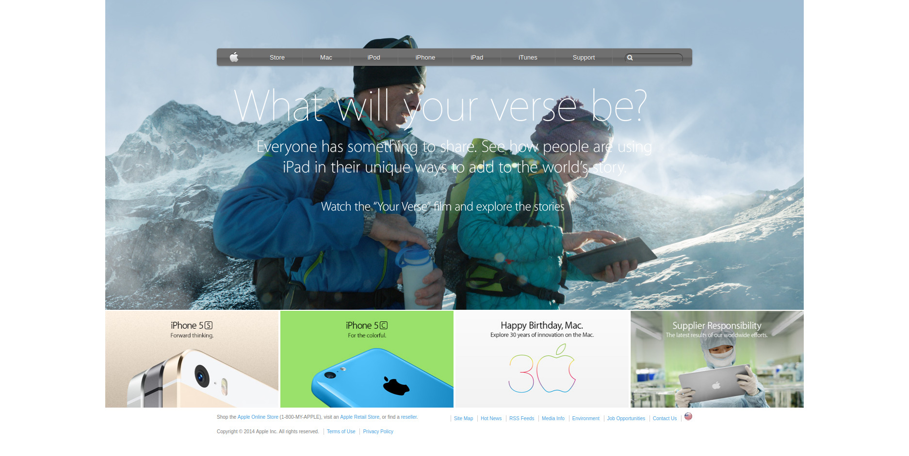

# Apple Clone

## Description
This a project to create clone of the old apple web page




## Built With
- HTML & CSS
- CSS gradient
- CSS background
- CSS flex box

## Usage
```Git
git https://github.com/oloomoses/apple-clone.git
cd apple-clone
git checkout development
firefox .
```
## Demo
- https://oloomoses.github.io/apple-clone/

## Author
👨 **Oloo Moses**
- Twitter: https://twitter.com/olooine
- Github: https://github.com/oloomoses

## Contributing
Pull requests are welcome. For major changes, please open an issue first to discuss what you would like to change.

Support this project with a ⭐️ and let me now if you would like to become a contributor!
